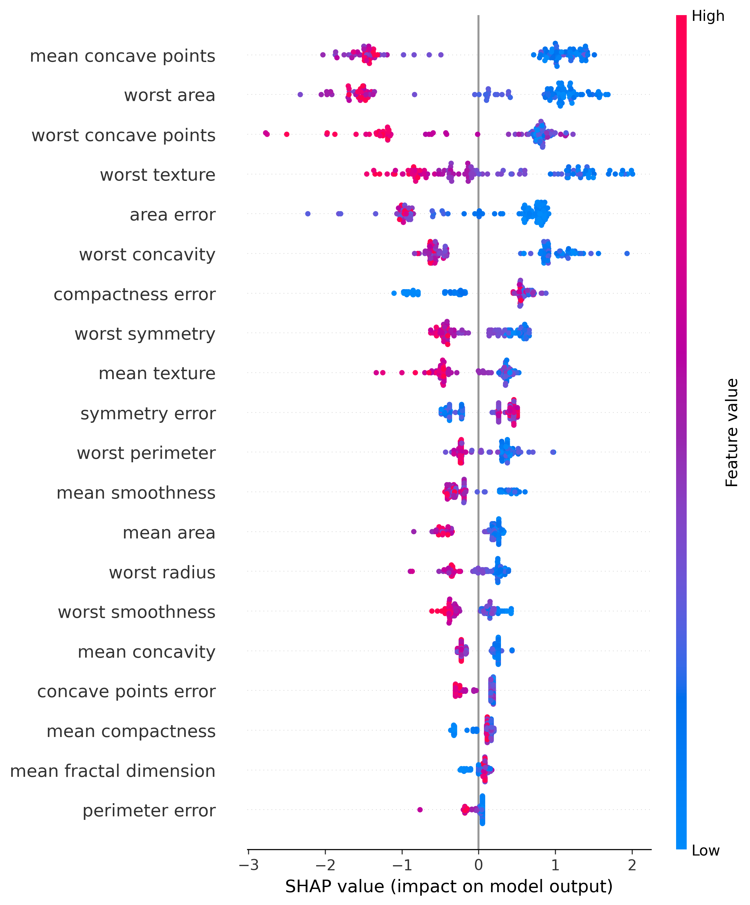
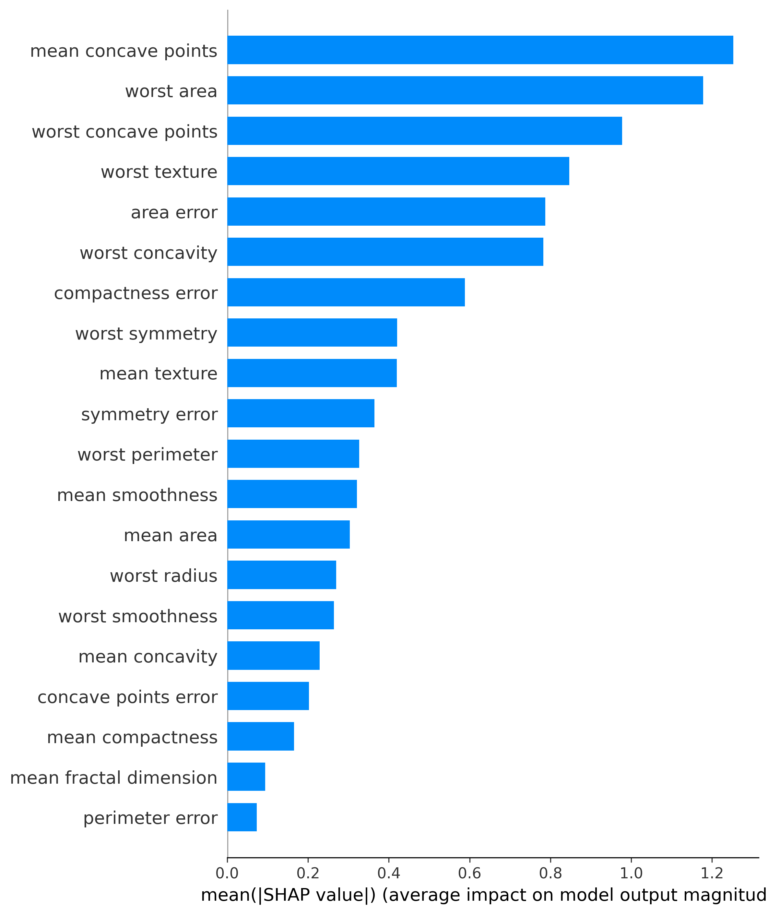

# Breast Cancer Classification and Explainability

This project builds and evaluates classical machine learning models for breast cancer diagnosis support using the Wisconsin Breast Cancer dataset. It also includes model interpretability with SHAP to explain feature-level impact on predictions.

## Project Highlights

- End-to-end notebook workflow from data loading to explainability
- Comparison of three classifiers: Random Forest, SVM, and XGBoost
- Strong model performance (all models above 95% accuracy)
- SHAP visual reports saved in the reports folder

## Project Structure

```text
ml-health/
|-- data/
|   `-- breast_cancer.csv
|-- notebooks/
|   |-- data_loading.ipynb
|   |-- step2_eda.ipynb
|   |-- step3_preprocessing.ipynb
|   |-- step4_model_training.ipynb
|   `-- step5_shap_interpretability.ipynb
|-- reports/
|   |-- shap_summary.png
|   |-- shap_bar.png
|   `-- shap_force_plot.html
|-- src/
`-- requirements.txt
```

## Dataset

- Source: scikit-learn `load_breast_cancer()` (exported to CSV in this project)
- Samples: 569
- Features: 30 numeric predictors
- Target: 1 output column (`target`)
- Total columns in CSV: 31 (30 features + target)
- Class distribution:
  - `target = 1`: 357
  - `target = 0`: 212

In the original sklearn dataset mapping, `target = 0` is malignant and `target = 1` is benign.

## Workflow

1. `notebooks/data_loading.ipynb`
   - Loads dataset from sklearn
   - Converts to DataFrame and saves `data/breast_cancer.csv`

2. `notebooks/step2_eda.ipynb`
   - Basic data inspection (`shape`, `info`, `describe`)
   - Class distribution plot
   - Correlation heatmap
   - Confirms no missing values

3. `notebooks/step3_preprocessing.ipynb`
   - Train/test split (80/20)
   - Feature scaling with `StandardScaler`
   - Prevents leakage by fitting scaler on training data only

4. `notebooks/step4_model_training.ipynb`
   - Trains:
     - `RandomForestClassifier`
     - `SVC(probability=True)`
     - `XGBClassifier`
   - Evaluates accuracy and classification reports

5. `notebooks/step5_shap_interpretability.ipynb`
   - Trains XGBoost for explainability analysis
   - Computes SHAP values
   - Exports summary, bar, and force-plot reports

## Model Results

The saved notebook outputs report the following test-set accuracies:

| Model | Accuracy |
|------|----------|
| Random Forest | 0.9649 (96.49%) |
| SVM | 0.9825 (98.25%) |
| XGBoost | 0.9561 (95.61%) |

Best-performing model by accuracy: SVM.

Classification report summary (test set, support = 114):

| Model | Accuracy | Macro Avg (P/R/F1) | Weighted Avg (P/R/F1) |
|------|----------|--------------------|------------------------|
| Random Forest | 0.96 | 0.97 / 0.96 / 0.96 | 0.97 / 0.96 / 0.96 |
| SVM | 0.98 | 0.99 / 0.98 / 0.98 | 0.98 / 0.98 / 0.98 |
| XGBoost | 0.96 | 0.96 / 0.95 / 0.95 | 0.96 / 0.96 / 0.96 |

## Explainability Results (SHAP)

Generated artifacts in `reports/`:

- `shap_summary.png`: SHAP beeswarm summary (global + directionality)
- `shap_bar.png`: mean absolute SHAP feature importance
- `shap_force_plot.html`: interactive force plot for local explanation

Top features (from SHAP bar chart) include:

1. `mean concave points`
2. `worst area`
3. `worst concave points`
4. `worst texture`
5. `area error`

### SHAP Summary Plot



### SHAP Feature Importance Bar Plot



To view local explanation interactively, open `reports/shap_force_plot.html` in a browser.

## Environment Setup

Create and activate a virtual environment, then install dependencies:

```bash
python -m venv venv
# Windows
venv\Scripts\activate

pip install -r requirements.txt
```

## How To Run

Run notebooks in this order:

1. `notebooks/data_loading.ipynb`
2. `notebooks/step2_eda.ipynb`
3. `notebooks/step3_preprocessing.ipynb`
4. `notebooks/step4_model_training.ipynb`
5. `notebooks/step5_shap_interpretability.ipynb`

## Notes and Limitations

- This project is educational and demonstrates ML workflow and model interpretability.
- Results are based on a single train/test split (`random_state=42`) and can be extended with cross-validation.
- This is not a clinical diagnostic system.

## Future Improvements

- Add cross-validation and hyperparameter tuning
- Add ROC-AUC and PR-AUC comparison
- Add model persistence (joblib/pickle)
- Add a simple inference script in `src/`
